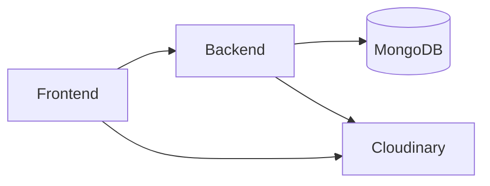
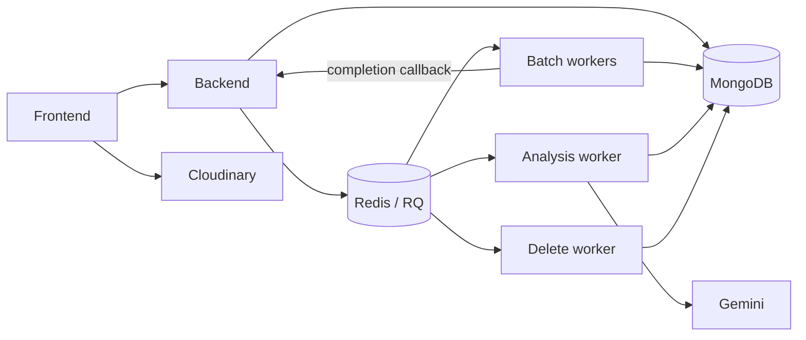

# ClearHire

ClearHire is recruiter decision-support software for organizing candidate resumes against a job's stated requirements. It helps recruiters review structured signals, rankings, and explanations; it does not make autonomous hiring decisions.

This monorepo contains the React frontend, Node.js API, and Python worker architecture that supports the full product.

## What it does

- Recruiters create and manage jobs with skills and experience requirements.
- Candidates' resumes are uploaded to Cloudinary and registered with the API.
- The complete implementation can process each resume asynchronously, extract text, match it against the job, rank candidates, and provide evidence-oriented explanations.
- Recruiters can request an on-demand deep analysis for an individual processed resume.

## Availability and deployment status

### Current public demo

The intentionally limited public demo runs the user-facing frontend and backend with MongoDB and Cloudinary. It supports the public demo experience, but it does **not** run the Python worker infrastructure. Consequently, it does not provide worker-dependent resume processing, ranking, explanations, or deep analysis.



### Complete implemented architecture

The repository implements the following worker-backed architecture. It is the intended shape for a future complete deployment, not a description of the current public demo.



## Complete processing workflow

1. A recruiter creates a job and uploads resumes through the frontend.
2. The frontend receives Cloudinary upload signatures from the backend, uploads files directly, and registers the uploaded-file metadata.
3. Creating a batch creates `ResumeProcessing` records and publishes one Redis/RQ task per resume.
4. Batch workers extract and normalize resume text, deduplicate completed work, generate local MiniLM embeddings, prefilter and rank passing resumes, and save deterministic explanations.
5. Workers update MongoDB and send completion callbacks to the backend so it can update batch and job counters.
6. The analysis worker performs recruiter-triggered Gemini analysis and stores the structured result.

## Engineering highlights

- Per-resume asynchronous jobs with batch, analysis, and cleanup worker types.
- MongoDB `ResumeProcessing` records track each resume/job combination.
- Redis-backed RQ-style queues and exponential-backoff scheduling for batch and analysis failures.
- Local `sentence-transformers/all-MiniLM-L6-v2` embeddings for the main matching pipeline.
- Deterministic prefiltering, scoring, and explanations; Gemini is reserved for on-demand deep analysis.

## Technology stack

| Area            | Technologies                                                           |
| --------------- | ---------------------------------------------------------------------- |
| Frontend        | React 19, TypeScript, Vite, React Router, TanStack Query, Tailwind CSS |
| Backend         | Node.js 22, Express 5, TypeScript, Mongoose, JWT                       |
| Data and queues | MongoDB, Redis, RQ-style Redis jobs                                    |
| Workers         | Python 3.11, RQ, PyMongo, sentence-transformers, PDFMiner, python-docx |
| AI and files    | MiniLM, Gemini, Cloudinary                                             |

## Repository structure

```text
ClearHire/
|- backend/              Express API, MongoDB models, Redis publishers
|- frontend/             React/Vite application
|- worker/               Python RQ workers and processing pipeline
|- docs/                 Architecture, pipeline, API, and deployment docs
|- docker-compose.yml    Redis, backend, workers, retry scheduler
|- KNOWN_ISSUES.md       Technical debt and operational limitations
`- README.md
```

## Local development

### Prerequisites

- Node.js 22 for the backend and Node-based tooling for the frontend.
- Python 3.11 for worker compatibility.
- MongoDB and Redis accessible to the backend and workers.
- Cloudinary configuration for uploads and cleanup.
- Gemini configuration only for deep analysis.
- Docker and Docker Compose when using the container setup.

### Setup overview

1. Configure uncommitted local environment values from the active configuration code in `backend/src/config/` and `worker/app/utils/`. The root `.env.example` is only a placeholder outline.
2. Run `npm ci` in `backend/` and `frontend/`. For local workers, install `worker/requirements.lock.txt` in an isolated Python environment.
3. Start MongoDB and Redis; then start the backend with `npm run dev` from `backend/` and the frontend with `npm run dev` from `frontend/`.
4. Run workers only after their MongoDB, Redis, callback, Cloudinary, and optional Gemini settings are configured.

### Docker Compose

Compose builds the backend and starts Redis, but **does not build the worker image**. The worker services require a prebuilt `clearhire-worker:locked` image produced from `worker/Dockerfile` (or otherwise made available locally). Compose also does not include a frontend service; run or deploy the frontend separately with `VITE_BACKEND_API_URL` configured.

## Documentation

- [Known issues](KNOWN_ISSUES.md)
- [Architecture](docs/Architecture.md)
- [Pipeline](docs/Pipeline.md)
- [API](docs/API.md)
- [Deployment](docs/Deployment.md)
- [Contributing](CONTRIBUTING.md)

The four `docs/` pages are currently placeholders and will become the canonical detailed documentation as they are completed.

## Current limitations

- The batch worker sends a completion callback once; when that HTTP request fails, the error is logged and no callback retry is implemented.
- The upload UI currently accepts PDF and DOC MIME types, while the worker's text extractor implements PDF and DOCX extraction. This format mismatch should be resolved before relying on DOCX uploads.
- The supplied Compose configuration is not a complete public deployment: it has no frontend service and requires a prebuilt worker image.

See [KNOWN_ISSUES.md](KNOWN_ISSUES.md) for the fuller operational issue list.

## Development and testing

The backend and frontend provide lint and build scripts:

```text
backend:  npm run lint && npm run build
frontend: npm run lint && npm run build
```

The repository does not contain a conventional automated test suite. The backend declares a test command, but its referenced source file is not present.

## Roadmap

- Reliability and recovery improvements
- Upload robustness
- Ranking and explanation improvements
- Automated testing
- A future complete worker-backed deployment

## Contributing

See [CONTRIBUTING.md](CONTRIBUTING.md).

## Developed by

# SHEKH AALIM
